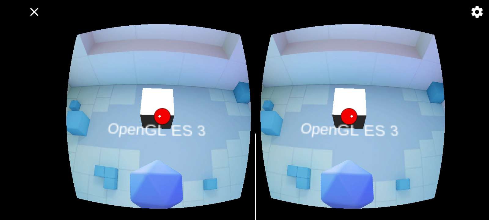
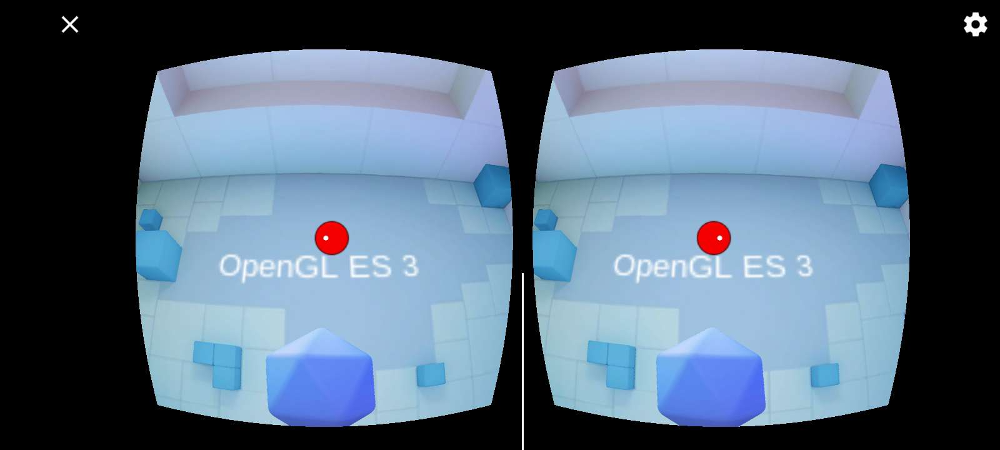
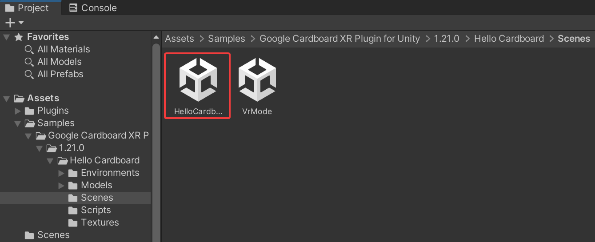
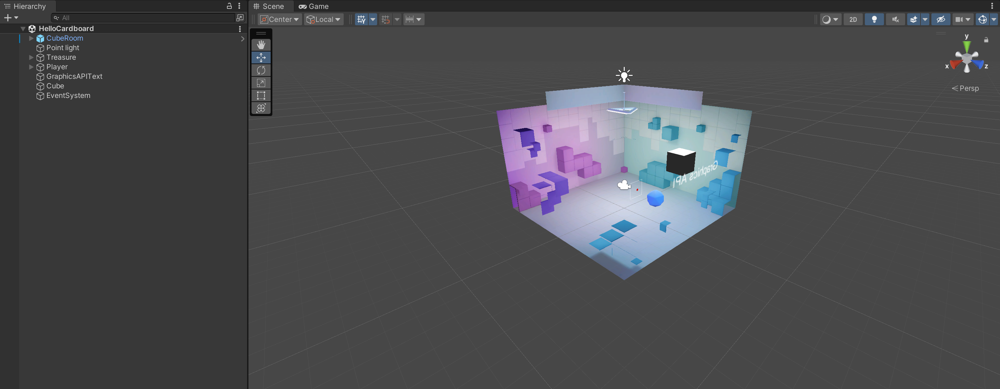
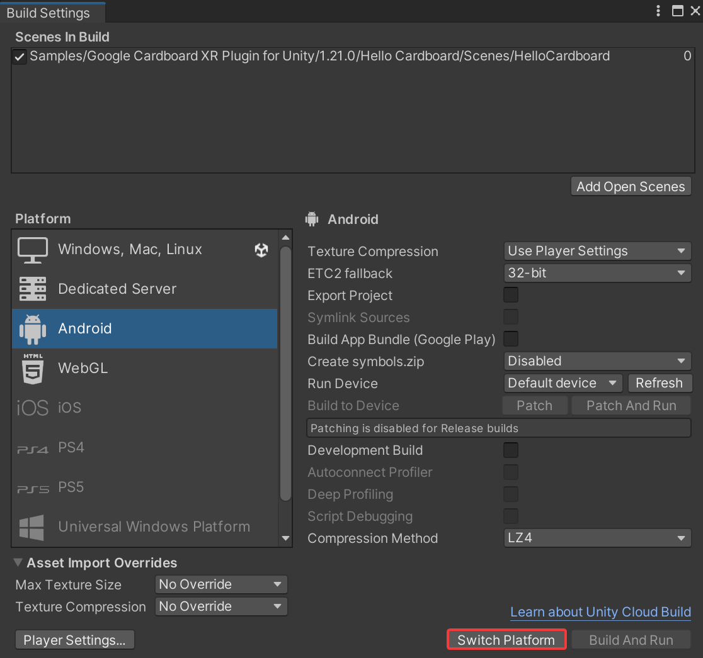

# Simple VR Game

A simple VR game to emulate _gaze shooting_ the player's goal is to find and remove cubes.

## Setup

If you cloned the repository, you may notice an empty scene. Don't worry, all the information is there. You just need to load it.

Navigate to `Assets/Samples/Google Cardboard/<version>/Hello Cardboard/Scenes` then select and open `HelloCardboard`.

The scene should look like this now:

If you want to build the project, go to the build settings and switch to the android platform. Then you can build the APK file.

